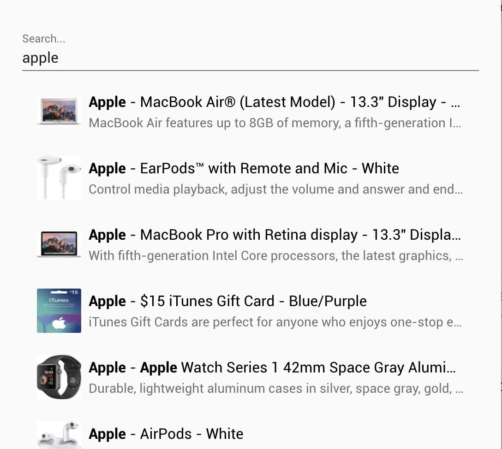

# \<algolia-element\>

[](https://www.webcomponents.org/element/owner/my-element)

This element will let you use Algolia&#39;s Instant Search from within your Polymer application

# Why this component
Algolia can be integrated in Angular, Vue and React but not in Polymer. Now it's possible!
This repo will let you use Algolias Instant Search with an easy to use component.

**Current features**

- Free text search on the full index

**Features in progress**

- Refinement list
- Pagination
- Numeric refinement
- Range filters
- Geo search

There will be more updates soon!

# Demo


This element uses the demo data from the Algolia website. This index contains a list of products from Amazon.

```html
<algolia-element
    app-id="latency"
    api-key="6be0576ff61c053d5f9a3225e2a90f76"
    index-name="instant_search">
</algolia-element>
```

# Installation
`bower install --save rovervannispen/algolia-element`

# Authors
Rover van Nispen tot Pannerden - Qlouder
See also the list of contributors who participated in this project.

# License
This project is licensed under the MIT License - see the LICENSE.md file for details.

# Acknowledgments
This component is based on the instantsearch.js library built by Algolia.